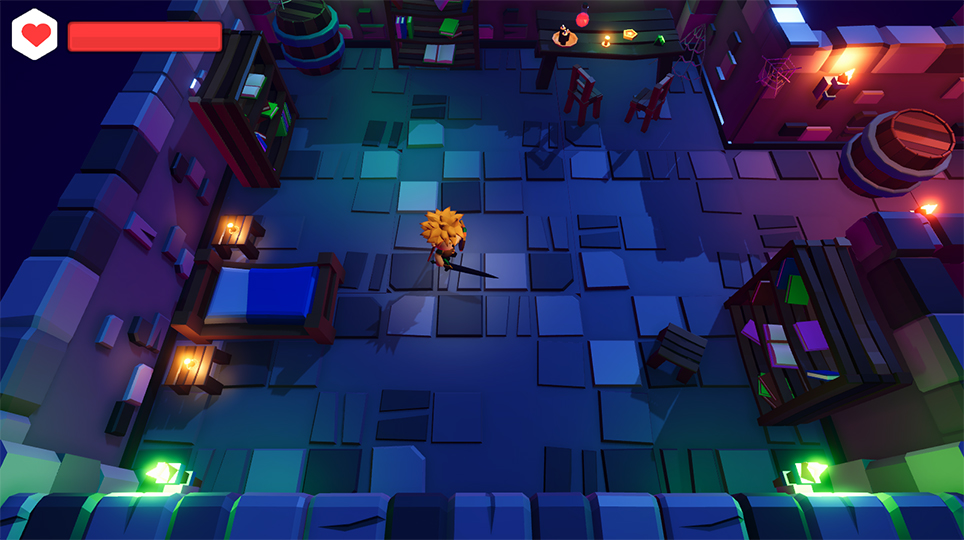

# Dungeon

Projeto pessoal de um jogo estilo roguelike. Esse jogo é o resultado final do curso Formação Unity 3D Game Developer da plataforma DIO (https://www.dio.me)

**Alguns recursos da Unity estudados:**
* Cinemachine com a mudança de câmera em alguns lugares do mapa do jogo
* Iluminação do cenário e de elementos do jogo
* Configurações de pós produção para ambientar melhor alguns cenários do jogo. 
  Exemplo: passar sensação de calor ou frio em partes do mapa
* Mecânicas de ataque e defesa do player com os inimigos
* Interação com objetos
* Inteligência artificial para os inimigos atacarem o player

# Game
**Jogue agora em** https://geisonleite.itch.io/dungeon

# Screenshots

  

    
	
	
	
  

## Assets do jogo

O Jogo contém os seguintes itens da Asset Store da Unity:

- [**RPG Tiny Hero Duo PBR Polyart** _por Dungeon Mason_](https://assetstore.unity.com/packages/3d/characters/humanoids/rpg-tiny-hero-duo-pbr-polyart-225148)
- [**RPG Monster Duo PBR Polyart** _por Dungeon Mason_](https://assetstore.unity.com/packages/3d/characters/creatures/rpg-monster-duo-pbr-polyart-157762)
- [**RPG Monster Partners PBR Polyart** _por Dungeon Mason_](https://assetstore.unity.com/packages/3d/characters/creatures/rpg-monster-partners-pbr-polyart-168251)
- [**Mini Legion Rock Golem PBR HP Polyart** _por Dungeon Mason_](https://assetstore.unity.com/packages/3d/characters/humanoids/fantasy/mini-legion-rock-golem-pbr-hp-polyart-94707)
- [**Mini Legion Lich PBR HP Polyart** _por Dungeon Mason_](https://assetstore.unity.com/packages/3d/characters/humanoids/fantasy/mini-legion-lich-pbr-hp-polyart-91497)
- [**Mini Legion Grunt PBR HP Polyart** _por Dungeon Mason_](https://assetstore.unity.com/packages/3d/characters/humanoids/fantasy/mini-legion-grunt-pbr-hp-polyart-98187)
- [**3D Dungeon Lowpoly Pack** _por CatBorg Studio_](https://assetstore.unity.com/packages/3d/props/furniture/3d-dungeon-lowpoly-pack-231265)
- [**Polygonal's Low-Poly Particle Pack** _por Polygonal Stuff_](https://assetstore.unity.com/packages/vfx/particles/polygonal-s-low-poly-particle-pack-118355)
- [**RPG Essentials Sound Effects** _por leohpaz_](https://assetstore.unity.com/packages/audio/sound-fx/rpg-essentials-sound-effects-free-227708)
- [**Hit VFX Mega Pack** _por Just Labbing_](https://assetstore.unity.com/packages/vfx/particles/hit-vfx-mega-pack-224741)
- [**Sprite Packs** _por Kenney_](https://www.kenney.nl/)
- Músicas por _Kevin MacLeod_: [incompetech.com](https://www.incompetech.com)
- Efeitos sonoros com licença pública obtidos em [freesound.org](https://freesound.org)